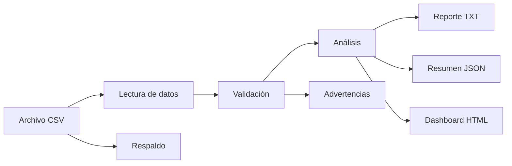
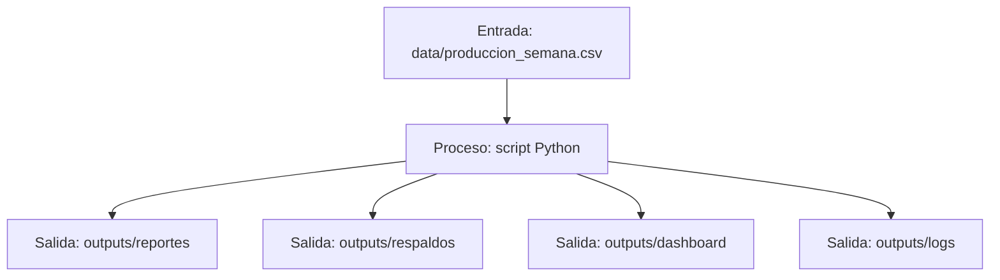
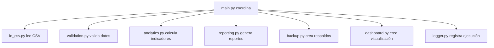

# Diagramas y flujos del proyecto

## Flujo general

## Entrada, proceso y salida

## Responsabilidad de los módulos

## Cómo usar estos diagramas

Estos diagramas sirven para explicar el proyecto en el README, en la bitácora o durante la sustentación. No es necesario memorizarlos; lo importante es entender que cada parte del proyecto tiene una función clara.
